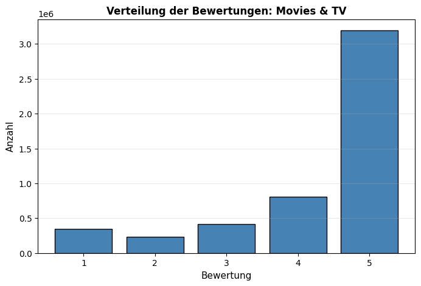
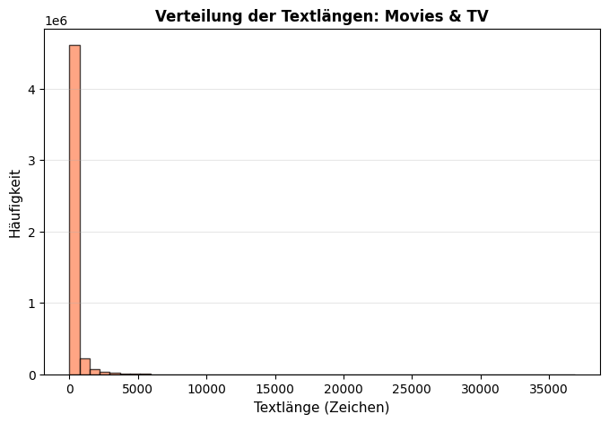
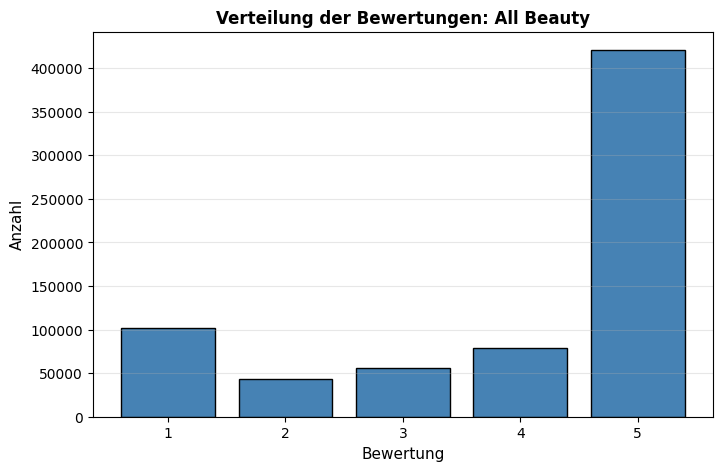
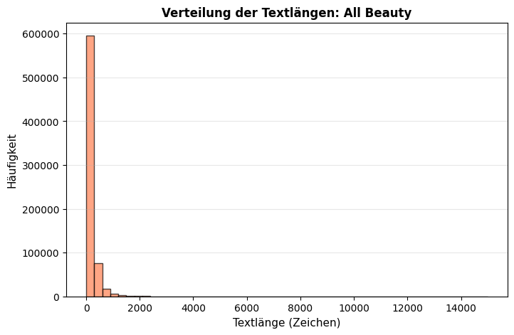
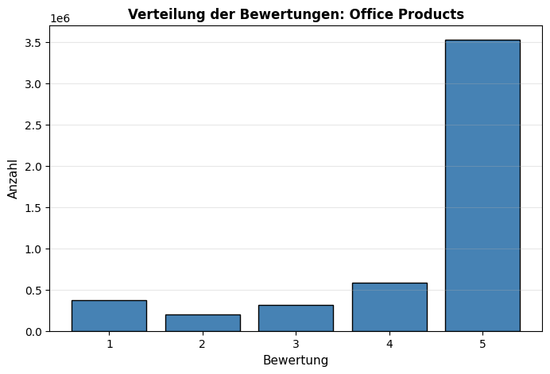
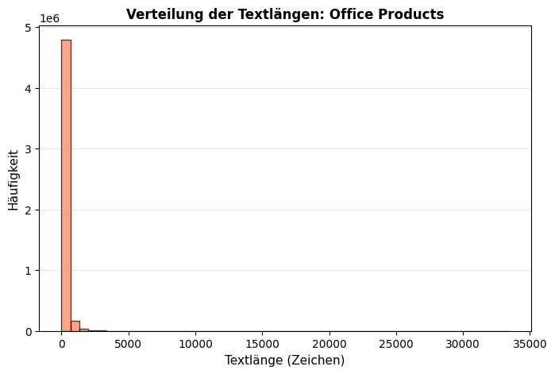
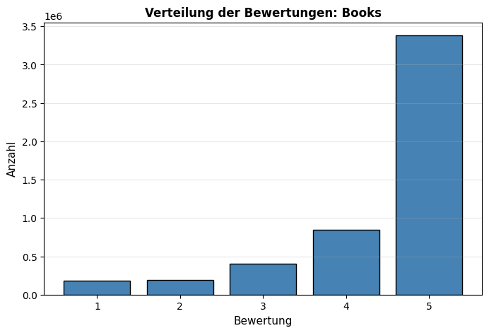
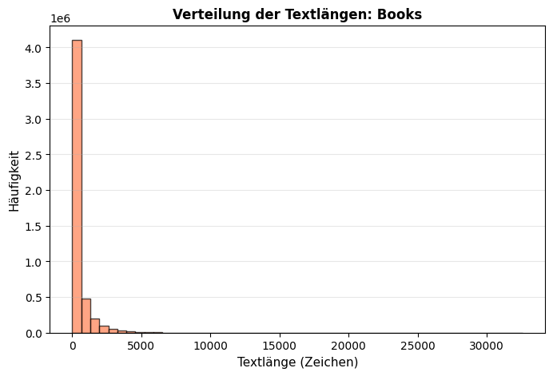

# EDA-Report: Sentimentanalyse

Amazon-Reviews aus 4 Produktkategorien

## Übersichtstabelle

| Kategorie       |   Datensätze |   Ø Textlänge |   Ø Wörter |   Bewertung 1 |   Bewertung 5 |
|:----------------|-------------:|--------------:|-----------:|--------------:|--------------:|
| Movies & TV     |      5000000 |           264 |         47 |        346285 |       3194129 |
| All Beauty      |       701528 |           173 |         33 |        102080 |        420726 |
| Office Products |      5000000 |           183 |         34 |        374968 |       3524641 |
| Books           |      5000000 |           434 |         77 |        182306 |       3381864 |

---

## Movies & TV

### Statistiken
- **Gesamtanzahl Datensätze:** 5,000,000
- **Fehlende Werte:** title=0, text=0, rating=0

### Verteilung der Bewertungen
- **1 Sterne:** 346,285 (6.9%)
- **2 Sterne:** 235,522 (4.7%)
- **3 Sterne:** 417,821 (8.4%)
- **4 Sterne:** 806,243 (16.1%)
- **5 Sterne:** 3,194,129 (63.9%)

### Textlänge (Zeichen)
| Kennzahl | Wert |
|--------|-------|
| Mittelwert | 264 |
| Standardabweichung | 628 |
| Minimum | 0 |
| Maximum | 36887 |
| Durchschnittliche Wortanzahl | 47 |

### Diagramm: Bewertungsverteilung

### Diagramm: Verteilung der Textlängen

---

## All Beauty

### Statistiken
- **Gesamtanzahl Datensätze:** 701,528
- **Fehlende Werte:** title=0, text=0, rating=0

### Verteilung der Bewertungen
- **1 Sterne:** 102,080 (14.6%)
- **2 Sterne:** 43,034 (6.1%)
- **3 Sterne:** 56,307 (8.0%)
- **4 Sterne:** 79,381 (11.3%)
- **5 Sterne:** 420,726 (60.0%)

### Textlänge (Zeichen)
| Kennzahl | Wert |
|--------|-------|
| Mittelwert | 173 |
| Standardabweichung | 247 |
| Minimum | 0 |
| Maximum | 14989 |
| Durchschnittliche Wortanzahl | 33 |

### Diagramm: Bewertungsverteilung

### Diagramm: Verteilung der Textlängen

---

## Office Products

### Statistiken
- **Gesamtanzahl Datensätze:** 5,000,000
- **Fehlende Werte:** title=0, text=0, rating=0

### Verteilung der Bewertungen
- **1 Sterne:** 374,968 (7.5%)
- **2 Sterne:** 199,852 (4.0%)
- **3 Sterne:** 316,761 (6.3%)
- **4 Sterne:** 583,778 (11.7%)
- **5 Sterne:** 3,524,641 (70.5%)

### Textlänge (Zeichen)
| Kennzahl | Wert |
|--------|-------|
| Mittelwert | 183 |
| Standardabweichung | 292 |
| Minimum | 0 |
| Maximum | 33432 |
| Durchschnittliche Wortanzahl | 34 |

### Diagramm: Bewertungsverteilung

### Diagramm: Verteilung der Textlängen

---

## Books

### Statistiken
- **Gesamtanzahl Datensätze:** 5,000,000
- **Fehlende Werte:** title=0, text=0, rating=4

### Verteilung der Bewertungen
- **1 Sterne:** 182,306 (3.6%)
- **2 Sterne:** 186,922 (3.7%)
- **3 Sterne:** 402,082 (8.0%)
- **4 Sterne:** 846,822 (16.9%)
- **5 Sterne:** 3,381,864 (67.6%)

### Textlänge (Zeichen)
| Kennzahl | Wert |
|--------|-------|
| Mittelwert | 434 |
| Standardabweichung | 770 |
| Minimum | 0 |
| Maximum | 32601 |
| Durchschnittliche Wortanzahl | 77 |

### Diagramm: Bewertungsverteilung

### Diagramm: Verteilung der Textlängen

---

## Zentrale Erkenntnisse

### Eigenschaften der Kategorien
- **Größter Datensatz:** Movies & TV (5,000,000 Datensätze)
- **Längste Texte:** Books (Ø 434 Zeichen)
- **Meiste Wörter:** Books (Ø 77 Wörter)

### Balance der Bewertungen
- **Movies & TV:** 6.9% negativ (1 Stern), 63.9% positiv (5 Sterne)
- **All Beauty:** 14.6% negativ (1 Stern), 60.0% positiv (5 Sterne)
- **Office Products:** 7.5% negativ (1 Stern), 70.5% positiv (5 Sterne)
- **Books:** 3.6% negativ (1 Stern), 67.6% positiv (5 Sterne)
