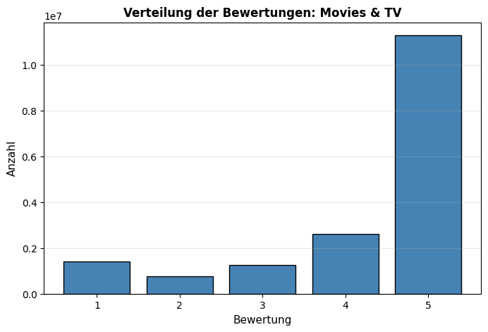
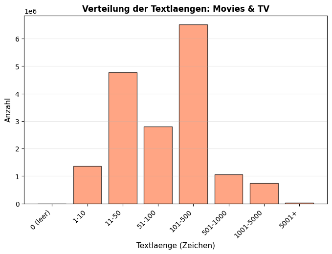
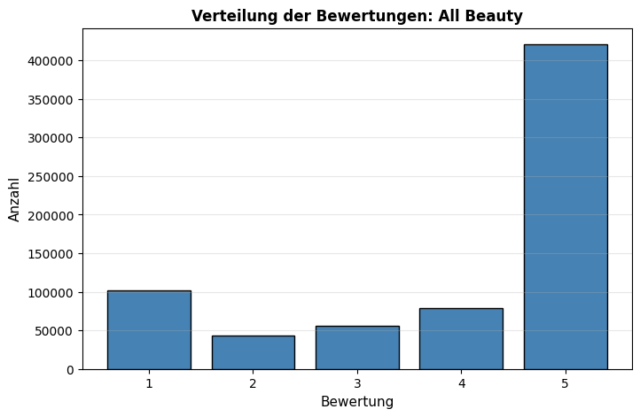
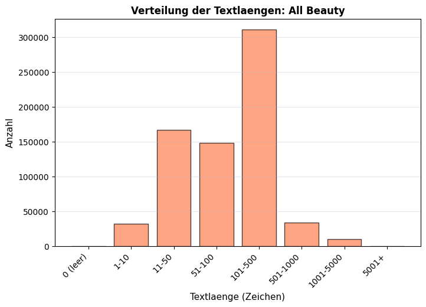
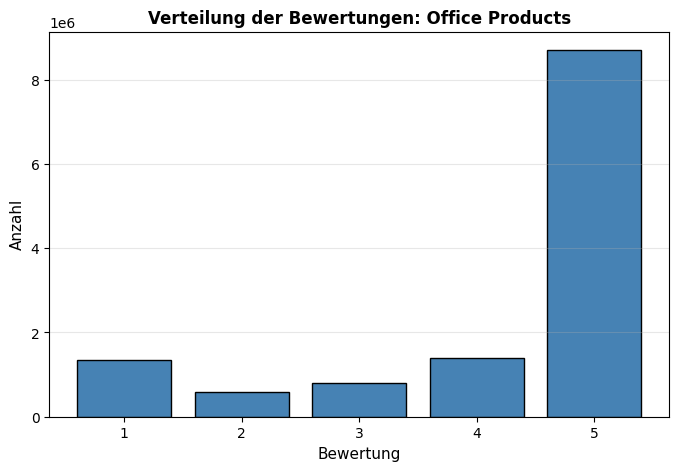
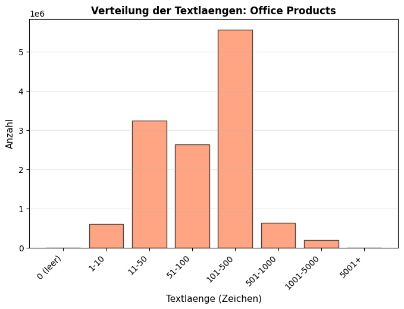
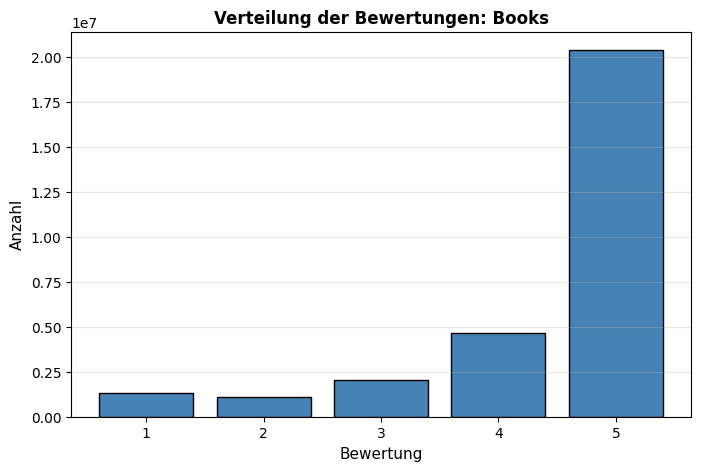
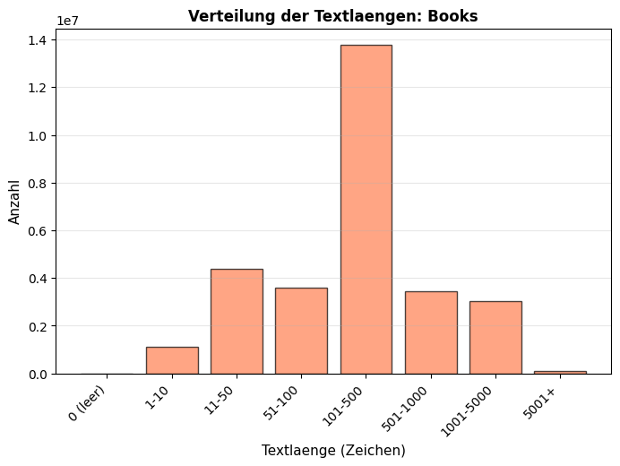

# EDA-Report: Sentimentanalyse

Amazon-Reviews aus 4 Produktkategorien (alle Records, kein Limit)

## Uebersichtstabelle

| Kategorie | Records gesamt | Valide | Ungueltige Ratings | Leere Texte | Ø Textlaenge | Ø Woerter |
|-----------|---------------|--------|-------------------|-------------|-------------|----------|
| Movies & TV | 17,328,314 | 17,328,314 | 0 | 650 | 237 | 42 |
| All Beauty | 701,528 | 701,528 | 0 | 107 | 173 | 33 |
| Office Products | 12,845,712 | 12,845,711 | 1 | 679 | 175 | 33 |
| Books | 29,475,453 | 29,475,449 | 4 | 967 | 423 | 75 |

---

## Movies & TV

### Statistiken
- Records gesamt: 17,328,314
- Valide Records: 17,328,314
- Ungueltige Ratings: 0
- JSON-Fehler: 0
- Fehlende Werte: title=0, text=0, rating=0
- Leere Texte: 650

### Bewertungsverteilung
- 1 Stern: 1,410,250 (8.1%)
- 2 Stern: 766,735 (4.4%)
- 3 Stern: 1,260,217 (7.3%)
- 4 Stern: 2,604,827 (15.0%)
- 5 Stern: 11,286,285 (65.1%)

### Textlaenge
- Mittelwert: 237 Zeichen / 42 Woerter
- Min: 0 / Max: 36887

### Textlaengen-Buckets
| Bucket | Anzahl |
|--------|--------|
| 0 (leer) | 650 |
| 1-10 | 1,370,573 |
| 11-50 | 4,784,168 |
| 51-100 | 2,811,819 |
| 101-500 | 6,519,559 |
| 501-1000 | 1,063,411 |
| 1001-5000 | 746,929 |
| 5001+ | 31,205 |

### Bewertungsverteilung

### Textlaengenverteilung

---

## All Beauty

### Statistiken
- Records gesamt: 701,528
- Valide Records: 701,528
- Ungueltige Ratings: 0
- JSON-Fehler: 0
- Fehlende Werte: title=0, text=0, rating=0
- Leere Texte: 107

### Bewertungsverteilung
- 1 Stern: 102,080 (14.6%)
- 2 Stern: 43,034 (6.1%)
- 3 Stern: 56,307 (8.0%)
- 4 Stern: 79,381 (11.3%)
- 5 Stern: 420,726 (60.0%)

### Textlaenge
- Mittelwert: 173 Zeichen / 33 Woerter
- Min: 0 / Max: 14989

### Textlaengen-Buckets
| Bucket | Anzahl |
|--------|--------|
| 0 (leer) | 107 |
| 1-10 | 32,212 |
| 11-50 | 166,493 |
| 51-100 | 148,169 |
| 101-500 | 310,873 |
| 501-1000 | 33,844 |
| 1001-5000 | 9,754 |
| 5001+ | 76 |

### Bewertungsverteilung

### Textlaengenverteilung

---

## Office Products

### Statistiken
- Records gesamt: 12,845,712
- Valide Records: 12,845,711
- Ungueltige Ratings: 1
- JSON-Fehler: 0
- Fehlende Werte: title=0, text=0, rating=0
- Leere Texte: 679

### Bewertungsverteilung
- 1 Stern: 1,353,519 (10.5%)
- 2 Stern: 589,120 (4.6%)
- 3 Stern: 799,194 (6.2%)
- 4 Stern: 1,400,675 (10.9%)
- 5 Stern: 8,703,203 (67.8%)

### Textlaenge
- Mittelwert: 175 Zeichen / 33 Woerter
- Min: 0 / Max: 33432

### Textlaengen-Buckets
| Bucket | Anzahl |
|--------|--------|
| 0 (leer) | 679 |
| 1-10 | 595,860 |
| 11-50 | 3,231,386 |
| 51-100 | 2,627,287 |
| 101-500 | 5,554,069 |
| 501-1000 | 635,755 |
| 1001-5000 | 198,476 |
| 5001+ | 2,199 |

### Bewertungsverteilung

### Textlaengenverteilung

---

## Books

### Statistiken
- Records gesamt: 29,475,453
- Valide Records: 29,475,449
- Ungueltige Ratings: 4
- JSON-Fehler: 0
- Fehlende Werte: title=0, text=0, rating=0
- Leere Texte: 967

### Bewertungsverteilung
- 1 Stern: 1,316,085 (4.5%)
- 2 Stern: 1,080,897 (3.7%)
- 3 Stern: 2,054,057 (7.0%)
- 4 Stern: 4,632,932 (15.7%)
- 5 Stern: 20,391,478 (69.2%)

### Textlaenge
- Mittelwert: 423 Zeichen / 75 Woerter
- Min: 0 / Max: 37878

### Textlaengen-Buckets
| Bucket | Anzahl |
|--------|--------|
| 0 (leer) | 967 |
| 1-10 | 1,116,644 |
| 11-50 | 4,401,050 |
| 51-100 | 3,592,472 |
| 101-500 | 13,777,789 |
| 501-1000 | 3,451,764 |
| 1001-5000 | 3,025,744 |
| 5001+ | 109,019 |

### Bewertungsverteilung

### Textlaengenverteilung

---

## Split-Verteilung (70/15/15)

| Kategorie | Split | Gesamt | 1 Stern | 2 Sterne | 3 Sterne | 4 Sterne | 5 Sterne |
|-----------|-------|--------|---------|----------|----------|----------|----------|
| Movies & TV | Train | 12,129,819 | 908,036 | 557,334 | 947,495 | 1,893,054 | 7,823,900 |
| Movies & TV | Val | 2,599,247 | 230,661 | 108,128 | 167,930 | 374,605 | 1,717,923 |
| Movies & TV | Test | 2,599,248 | 271,553 | 101,273 | 144,792 | 337,168 | 1,744,462 |
| All Beauty | Train | 491,069 | 64,369 | 30,333 | 41,491 | 57,929 | 296,947 |
| All Beauty | Val | 105,229 | 17,169 | 6,439 | 7,816 | 11,185 | 62,620 |
| All Beauty | Test | 105,230 | 20,542 | 6,262 | 7,000 | 10,267 | 61,159 |
| Office Products | Train | 8,991,997 | 788,745 | 387,053 | 568,374 | 1,014,000 | 6,233,825 |
| Office Products | Val | 1,926,856 | 251,295 | 97,316 | 117,044 | 200,183 | 1,261,018 |
| Office Products | Test | 1,926,858 | 313,479 | 104,751 | 113,776 | 186,492 | 1,208,360 |
| Books | Train | 20,632,814 | 838,284 | 769,677 | 1,545,458 | 3,416,487 | 14,062,908 |
| Books | Val | 4,421,317 | 222,023 | 158,347 | 274,448 | 648,563 | 3,117,936 |
| Books | Test | 4,421,318 | 255,778 | 152,873 | 234,151 | 567,882 | 3,210,634 |
